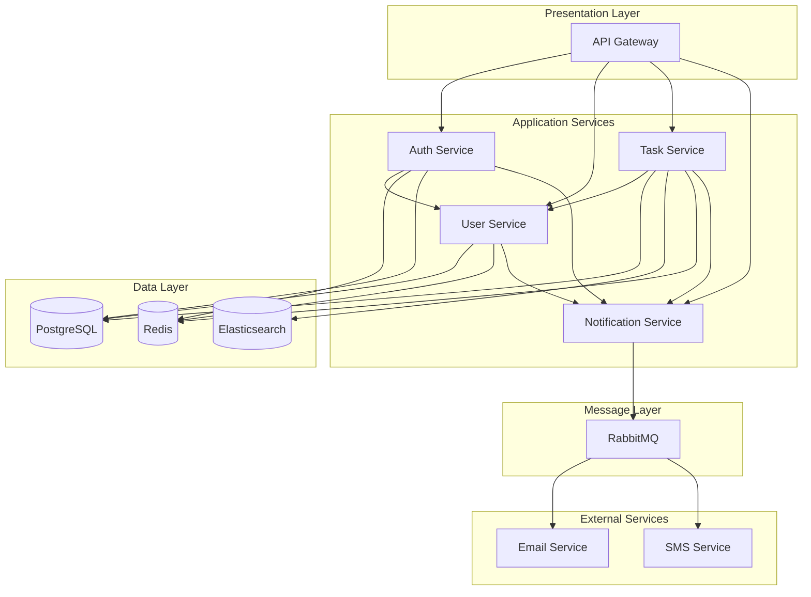
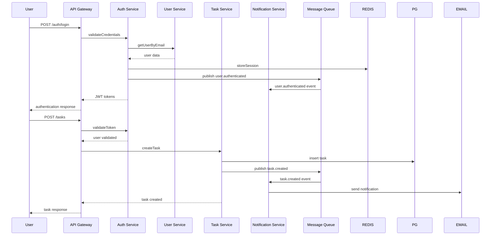

# Component Architecture and Relationships

## Component Overview

This document details the individual components within the system architecture, their relationships, interfaces, and responsibilities.

## Core Components

### 1. Authentication Service
```yaml
component_name: "Authentication Service"
type: "Microservice"
responsibility: "User authentication and authorization"

interfaces:
  rest_api:
    - POST /auth/login
    - POST /auth/logout
    - POST /auth/refresh
    - GET /auth/verify
    - POST /auth/reset-password
  
  internal_api:
    - validateToken(token: string): User | null
    - generateTokens(user: User): TokenPair
    - revokeSession(sessionId: string): boolean

dependencies:
  internal:
    - user_service: "User profile validation"
    - notification_service: "Password reset emails"
  
  external:
    - redis: "Session storage"
    - postgresql: "User credentials"
    - email_service: "Password reset notifications"

events:
  publishes:
    - user.authenticated
    - user.logout
    - session.expired
    - password.reset_requested
  
  subscribes:
    - user.deleted
    - user.suspended
    - user.password_changed

scaling:
  horizontal: true
  instances: "2-10 based on load"
  stateless: true
```

### 2. User Service
```yaml
component_name: "User Service"
type: "Microservice"
responsibility: "User profile and account management"

interfaces:
  rest_api:
    - GET /users/profile
    - PUT /users/profile
    - DELETE /users/account
    - GET /users/{id}
    - POST /users/preferences
  
  internal_api:
    - getUserById(id: UUID): User | null
    - createUser(userData: CreateUserDto): User
    - updateUser(id: UUID, updates: UpdateUserDto): User
    - deleteUser(id: UUID): boolean

dependencies:
  internal:
    - notification_service: "Account notifications"
    - file_service: "Profile image storage"
  
  external:
    - postgresql: "User data persistence"
    - redis: "Profile caching"
    - s3: "Profile image storage"

events:
  publishes:
    - user.created
    - user.updated
    - user.deleted
    - user.preferences_changed
  
  subscribes:
    - auth.user_authenticated
    - payment.subscription_updated

data_model:
  entities:
    - User: "Core user entity"
    - UserProfile: "Extended profile information"
    - UserPreferences: "User settings and preferences"
```

### 3. Task Service
```yaml
component_name: "Task Service"
type: "Microservice"
responsibility: "Task and project management"

interfaces:
  rest_api:
    - GET /tasks
    - POST /tasks
    - PUT /tasks/{id}
    - DELETE /tasks/{id}
    - GET /projects
    - POST /projects
  
  internal_api:
    - getTasksByUser(userId: UUID): Task[]
    - createTask(taskData: CreateTaskDto): Task
    - updateTaskStatus(taskId: UUID, status: TaskStatus): Task
    - assignTask(taskId: UUID, assigneeId: UUID): Task

dependencies:
  internal:
    - user_service: "User validation"
    - notification_service: "Task notifications"
  
  external:
    - postgresql: "Task data persistence"
    - elasticsearch: "Task search and filtering"
    - redis: "Task caching"

events:
  publishes:
    - task.created
    - task.updated
    - task.completed
    - task.assigned
    - project.created
  
  subscribes:
    - user.deleted
    - notification.sent

business_logic:
  - Task lifecycle management
  - Project organization
  - Assignment and collaboration
  - Progress tracking
```

### 4. Notification Service
```yaml
component_name: "Notification Service"
type: "Microservice"
responsibility: "Multi-channel notification delivery"

interfaces:
  rest_api:
    - GET /notifications
    - PUT /notifications/{id}/read
    - POST /notifications/preferences
  
  internal_api:
    - sendNotification(notification: NotificationDto): boolean
    - scheduleNotification(notification: NotificationDto, delay: Duration): string
    - getUnreadCount(userId: UUID): number

dependencies:
  external:
    - rabbitmq: "Message queuing"
    - email_service: "Email delivery"
    - sms_service: "SMS delivery"
    - push_service: "Push notifications"
    - postgresql: "Notification history"

events:
  subscribes:
    - user.created
    - task.created
    - task.assigned
    - task.completed
    - auth.password_reset_requested
  
  publishes:
    - notification.sent
    - notification.failed
    - notification.read

channels:
  - email: "Email notifications"
  - sms: "SMS notifications"
  - push: "Mobile push notifications"
  - in_app: "In-application notifications"
```

## Infrastructure Components

### 5. API Gateway
```yaml
component_name: "API Gateway"
type: "Infrastructure Service"
responsibility: "Request routing, authentication, rate limiting"

features:
  - Request routing and load balancing
  - Authentication and authorization
  - Rate limiting and throttling
  - Request/response transformation
  - API versioning support
  - CORS handling

configuration:
  rate_limiting:
    - authenticated: "1000 req/min"
    - anonymous: "100 req/min"
    - premium: "5000 req/min"
  
  routing:
    - "/api/v1/auth/*": "authentication_service"
    - "/api/v1/users/*": "user_service"
    - "/api/v1/tasks/*": "task_service"
    - "/api/v1/notifications/*": "notification_service"
```

### 6. Database Layer
```yaml
component_name: "Database Layer"
type: "Data Infrastructure"
responsibility: "Data persistence and retrieval"

databases:
  primary:
    type: "PostgreSQL 14+"
    purpose: "Transactional data"
    features:
      - ACID compliance
      - Foreign key constraints
      - Indexing optimization
      - Partitioning for large tables
  
  cache:
    type: "Redis 7+"
    purpose: "Session storage and caching"
    features:
      - Key expiration
      - Pub/sub messaging
      - Cluster mode for HA
  
  search:
    type: "Elasticsearch"
    purpose: "Full-text search and analytics"
    features:
      - Real-time search
      - Aggregations
      - Scalable indexing

connection_management:
  pooling: "PgBouncer for connection pooling"
  monitoring: "pg_stat_statements for query analysis"
  backup: "Automated daily backups with PITR"
```

## Component Relationships

### Service Dependencies


### Event Flow


## Interface Contracts

### REST API Standards
```yaml
response_format:
  success:
    status: "success"
    data: {} # Response payload
    meta: {} # Pagination, timestamps, etc.
  
  error:
    status: "error"
    error:
      code: "ERROR_CODE"
      message: "Human readable message"
      details: {} # Additional error context

http_status_codes:
  - 200: "Success"
  - 201: "Created"
  - 400: "Bad Request"
  - 401: "Unauthorized"
  - 403: "Forbidden"
  - 404: "Not Found"
  - 409: "Conflict"
  - 422: "Validation Error"
  - 429: "Rate Limited"
  - 500: "Internal Server Error"

headers:
  - "Content-Type: application/json"
  - "X-Request-ID: {uuid}"
  - "X-Rate-Limit-Remaining: {count}"
  - "Authorization: Bearer {token}"
```

### Event Schema Standards
```yaml
event_structure:
  id: "uuid"
  type: "domain.event_name"
  timestamp: "ISO 8601 datetime"
  version: "semver"
  source: "service_name"
  data: {} # Event payload
  metadata:
    correlation_id: "uuid"
    user_id: "uuid (if applicable)"
    trace_id: "uuid"

example_events:
  user_created:
    type: "user.created"
    data:
      user_id: "uuid"
      email: "string"
      created_at: "datetime"
  
  task_assigned:
    type: "task.assigned"
    data:
      task_id: "uuid"
      assignee_id: "uuid"
      assigned_by: "uuid"
      assigned_at: "datetime"
```

## Component Scaling Patterns

### Horizontal Scaling
```yaml
stateless_services:
  - authentication_service: "2-10 instances"
  - user_service: "2-20 instances"
  - task_service: "3-15 instances"
  - notification_service: "1-5 instances"

scaling_triggers:
  cpu_utilization: "> 70%"
  memory_utilization: "> 80%"
  request_rate: "> 1000/sec per instance"
  response_time: "> 200ms p95"

load_balancing:
  algorithm: "Round robin with health checks"
  health_check_path: "/health"
  health_check_interval: "30s"
  unhealthy_threshold: "3 consecutive failures"
```

### Data Layer Scaling
```yaml
postgresql:
  read_replicas: "3 replicas"
  connection_pooling: "PgBouncer (100 max connections)"
  partitioning: "Range partitioning for time-series data"

redis:
  cluster_mode: "6 nodes (3 master + 3 replica)"
  memory_optimization: "Key expiration and eviction policies"
  persistence: "RDB snapshots + AOF logging"

elasticsearch:
  cluster: "3 nodes minimum"
  sharding: "Time-based index sharding"
  replication: "1 replica per shard"
```

## Security Considerations

### Component Security
```yaml
authentication_service:
  - JWT signing with RS256
  - Rate limiting for auth endpoints
  - Password hashing with bcrypt
  - Session management with Redis
  - MFA support (TOTP)

inter_service_communication:
  - mTLS for service-to-service communication
  - Service mesh for traffic encryption
  - API keys for internal service authentication
  - Network policies for pod-to-pod communication

data_protection:
  - Encryption at rest (AES-256)
  - TLS 1.3 for data in transit
  - PII data encryption in database
  - Audit logging for sensitive operations
```

This component architecture provides a clear separation of concerns while enabling scalability, maintainability, and security across all system components.