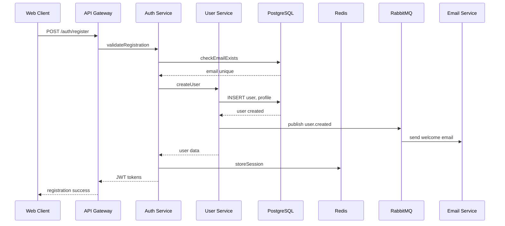
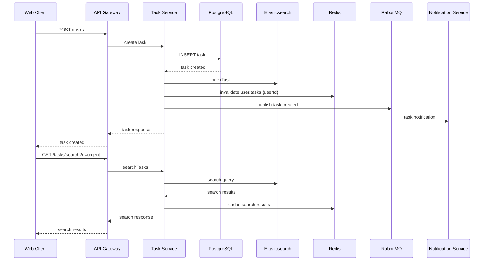
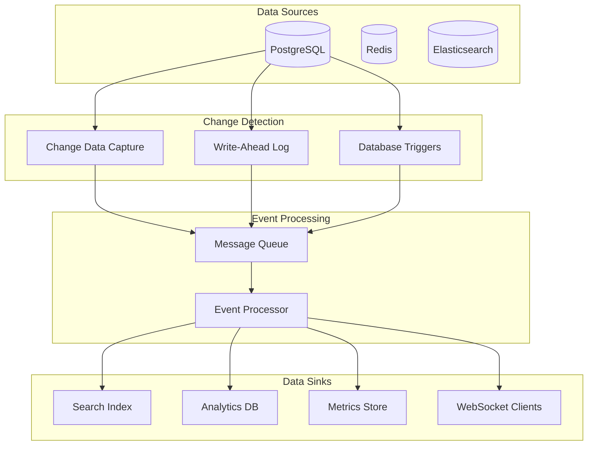

# Data Architecture and Flow

## Data Architecture Overview

This document defines the data architecture, flow patterns, and data management strategies for the system. It covers data models, storage strategies, data flow patterns, and data governance.

## Data Model Architecture

### Domain Data Models

#### User Domain
```typescript
// Core User Entity
interface User {
  id: UUID;
  email: string;
  emailVerified: boolean;
  passwordHash: string;
  status: UserStatus;
  createdAt: Date;
  updatedAt: Date;
  profile: UserProfile;
  preferences: UserPreferences;
}

interface UserProfile {
  firstName: string;
  lastName: string;
  avatar?: string;
  bio?: string;
  location?: string;
  timezone: string;
  language: string;
}

interface UserPreferences {
  notifications: NotificationPreferences;
  privacy: PrivacySettings;
  theme: 'light' | 'dark' | 'system';
}

enum UserStatus {
  ACTIVE = 'active',
  INACTIVE = 'inactive',
  SUSPENDED = 'suspended',
  DELETED = 'deleted'
}
```

#### Task Domain
```typescript
interface Task {
  id: UUID;
  title: string;
  description?: string;
  status: TaskStatus;
  priority: TaskPriority;
  dueDate?: Date;
  createdBy: UUID;
  assignedTo?: UUID;
  projectId?: UUID;
  tags: string[];
  createdAt: Date;
  updatedAt: Date;
  completedAt?: Date;
}

interface Project {
  id: UUID;
  name: string;
  description?: string;
  status: ProjectStatus;
  ownerId: UUID;
  memberIds: UUID[];
  createdAt: Date;
  updatedAt: Date;
}

enum TaskStatus {
  TODO = 'todo',
  IN_PROGRESS = 'in_progress',
  IN_REVIEW = 'in_review',
  COMPLETED = 'completed',
  CANCELLED = 'cancelled'
}

enum TaskPriority {
  LOW = 'low',
  MEDIUM = 'medium',
  HIGH = 'high',
  CRITICAL = 'critical'
}
```

#### Authentication Domain
```typescript
interface Session {
  id: UUID;
  userId: UUID;
  tokenHash: string;
  refreshTokenHash: string;
  expiresAt: Date;
  ipAddress?: string;
  userAgent?: string;
  createdAt: Date;
  lastAccessedAt: Date;
}

interface PasswordReset {
  id: UUID;
  userId: UUID;
  tokenHash: string;
  expiresAt: Date;
  used: boolean;
  createdAt: Date;
}
```

## Data Storage Architecture

### Primary Database (PostgreSQL)
```sql
-- Database schema organization
CREATE SCHEMA users;
CREATE SCHEMA tasks;
CREATE SCHEMA auth;
CREATE SCHEMA audit;

-- Users schema
CREATE TABLE users.users (
    id UUID PRIMARY KEY DEFAULT gen_random_uuid(),
    email VARCHAR(255) UNIQUE NOT NULL,
    email_verified BOOLEAN DEFAULT false,
    password_hash VARCHAR(255) NOT NULL,
    status VARCHAR(50) DEFAULT 'active',
    created_at TIMESTAMP WITH TIME ZONE DEFAULT CURRENT_TIMESTAMP,
    updated_at TIMESTAMP WITH TIME ZONE DEFAULT CURRENT_TIMESTAMP,
    
    CONSTRAINT valid_email CHECK (email ~* '^[A-Za-z0-9._%+-]+@[A-Za-z0-9.-]+\.[A-Za-z]{2,}$'),
    CONSTRAINT valid_status CHECK (status IN ('active', 'inactive', 'suspended', 'deleted'))
);

CREATE TABLE users.user_profiles (
    user_id UUID PRIMARY KEY REFERENCES users.users(id) ON DELETE CASCADE,
    first_name VARCHAR(100),
    last_name VARCHAR(100),
    avatar_url TEXT,
    bio TEXT,
    location VARCHAR(255),
    timezone VARCHAR(50) DEFAULT 'UTC',
    language VARCHAR(10) DEFAULT 'en',
    created_at TIMESTAMP WITH TIME ZONE DEFAULT CURRENT_TIMESTAMP,
    updated_at TIMESTAMP WITH TIME ZONE DEFAULT CURRENT_TIMESTAMP
);

-- Tasks schema
CREATE TABLE tasks.projects (
    id UUID PRIMARY KEY DEFAULT gen_random_uuid(),
    name VARCHAR(255) NOT NULL,
    description TEXT,
    status VARCHAR(50) DEFAULT 'active',
    owner_id UUID NOT NULL REFERENCES users.users(id),
    created_at TIMESTAMP WITH TIME ZONE DEFAULT CURRENT_TIMESTAMP,
    updated_at TIMESTAMP WITH TIME ZONE DEFAULT CURRENT_TIMESTAMP,
    
    CONSTRAINT valid_project_status CHECK (status IN ('active', 'archived', 'deleted'))
);

CREATE TABLE tasks.tasks (
    id UUID PRIMARY KEY DEFAULT gen_random_uuid(),
    title VARCHAR(500) NOT NULL,
    description TEXT,
    status VARCHAR(50) DEFAULT 'todo',
    priority VARCHAR(50) DEFAULT 'medium',
    due_date TIMESTAMP WITH TIME ZONE,
    created_by UUID NOT NULL REFERENCES users.users(id),
    assigned_to UUID REFERENCES users.users(id),
    project_id UUID REFERENCES tasks.projects(id),
    tags TEXT[] DEFAULT '{}',
    created_at TIMESTAMP WITH TIME ZONE DEFAULT CURRENT_TIMESTAMP,
    updated_at TIMESTAMP WITH TIME ZONE DEFAULT CURRENT_TIMESTAMP,
    completed_at TIMESTAMP WITH TIME ZONE,
    
    CONSTRAINT valid_task_status CHECK (status IN ('todo', 'in_progress', 'in_review', 'completed', 'cancelled')),
    CONSTRAINT valid_priority CHECK (priority IN ('low', 'medium', 'high', 'critical'))
);

-- Authentication schema
CREATE TABLE auth.sessions (
    id UUID PRIMARY KEY DEFAULT gen_random_uuid(),
    user_id UUID NOT NULL REFERENCES users.users(id) ON DELETE CASCADE,
    token_hash VARCHAR(255) UNIQUE NOT NULL,
    refresh_token_hash VARCHAR(255) UNIQUE NOT NULL,
    expires_at TIMESTAMP WITH TIME ZONE NOT NULL,
    ip_address INET,
    user_agent TEXT,
    created_at TIMESTAMP WITH TIME ZONE DEFAULT CURRENT_TIMESTAMP,
    last_accessed_at TIMESTAMP WITH TIME ZONE DEFAULT CURRENT_TIMESTAMP,
    
    INDEX idx_sessions_user_id (user_id),
    INDEX idx_sessions_token_hash (token_hash),
    INDEX idx_sessions_expires_at (expires_at)
);
```

### Indexing Strategy
```sql
-- Performance optimization indexes
CREATE INDEX CONCURRENTLY idx_users_email_status ON users.users(email, status) WHERE status = 'active';
CREATE INDEX CONCURRENTLY idx_tasks_assigned_status ON tasks.tasks(assigned_to, status) WHERE status != 'completed';
CREATE INDEX CONCURRENTLY idx_tasks_project_status ON tasks.tasks(project_id, status);
CREATE INDEX CONCURRENTLY idx_tasks_created_by_date ON tasks.tasks(created_by, created_at DESC);
CREATE INDEX CONCURRENTLY idx_tasks_due_date ON tasks.tasks(due_date) WHERE due_date IS NOT NULL;
CREATE INDEX CONCURRENTLY idx_sessions_user_expires ON auth.sessions(user_id, expires_at) WHERE expires_at > NOW();

-- Full-text search indexes
CREATE INDEX CONCURRENTLY idx_tasks_search ON tasks.tasks USING gin(to_tsvector('english', title || ' ' || COALESCE(description, '')));
CREATE INDEX CONCURRENTLY idx_projects_search ON tasks.projects USING gin(to_tsvector('english', name || ' ' || COALESCE(description, '')));
```

### Caching Strategy (Redis)
```yaml
cache_layers:
  l1_application_cache:
    duration: "5 minutes"
    use_cases:
      - User profiles
      - Task lists
      - Project metadata
  
  l2_session_cache:
    duration: "Until expiry"
    use_cases:
      - User sessions
      - JWT tokens
      - Password reset tokens
  
  l3_computed_cache:
    duration: "1 hour"
    use_cases:
      - Dashboard statistics
      - User task counts
      - Project progress

cache_keys:
  patterns:
    - "user:profile:{userId}"
    - "user:tasks:{userId}:page:{page}"
    - "project:{projectId}:members"
    - "session:{tokenHash}"
    - "stats:user:{userId}:daily"
    - "search:tasks:{query}:{filters}"

invalidation_strategy:
  - Event-driven cache invalidation
  - TTL-based expiration
  - Pattern-based bulk invalidation
```

### Search Index (Elasticsearch)
```json
{
  "mappings": {
    "tasks": {
      "properties": {
        "id": { "type": "keyword" },
        "title": { 
          "type": "text", 
          "analyzer": "english",
          "fields": {
            "keyword": { "type": "keyword" }
          }
        },
        "description": { 
          "type": "text", 
          "analyzer": "english" 
        },
        "status": { "type": "keyword" },
        "priority": { "type": "keyword" },
        "tags": { "type": "keyword" },
        "createdBy": { "type": "keyword" },
        "assignedTo": { "type": "keyword" },
        "projectId": { "type": "keyword" },
        "dueDate": { "type": "date" },
        "createdAt": { "type": "date" },
        "updatedAt": { "type": "date" }
      }
    }
  }
}
```

## Data Flow Patterns

### 1. User Registration Flow


### 2. Task Management Flow


### 3. Real-time Data Synchronization


## Data Consistency Patterns

### ACID Transactions
```typescript
// Example: Task assignment with notification
async function assignTask(taskId: UUID, assigneeId: UUID, assignedBy: UUID) {
  const client = await pool.connect();
  
  try {
    await client.query('BEGIN');
    
    // Update task
    const taskResult = await client.query(
      'UPDATE tasks.tasks SET assigned_to = $1, updated_at = NOW() WHERE id = $2 RETURNING *',
      [assigneeId, taskId]
    );
    
    // Create activity log
    await client.query(
      'INSERT INTO audit.activity_log (entity_type, entity_id, action, actor_id, metadata) VALUES ($1, $2, $3, $4, $5)',
      ['task', taskId, 'assigned', assignedBy, { assignedTo: assigneeId }]
    );
    
    await client.query('COMMIT');
    
    // Async operations after successful commit
    await eventBus.publish('task.assigned', {
      taskId,
      assigneeId,
      assignedBy,
      timestamp: new Date()
    });
    
    return taskResult.rows[0];
  } catch (error) {
    await client.query('ROLLBACK');
    throw error;
  } finally {
    client.release();
  }
}
```

### Eventual Consistency
```typescript
// Example: Search index synchronization
class TaskEventHandler {
  async handleTaskCreated(event: TaskCreatedEvent) {
    try {
      // Index in Elasticsearch (eventual consistency)
      await this.searchService.indexTask({
        id: event.taskId,
        title: event.title,
        description: event.description,
        status: event.status,
        tags: event.tags,
        createdAt: event.timestamp
      });
      
      // Update analytics (eventual consistency)
      await this.analyticsService.recordTaskCreation(event);
      
    } catch (error) {
      // Retry mechanism for failed operations
      await this.retryQueue.add('task.index', event, {
        attempts: 3,
        backoff: 'exponential'
      });
    }
  }
}
```

## Data Migration and Versioning

### Migration Strategy
```typescript
// Database migration example
class Migration_20240115_AddTaskTags {
  async up(knex: Knex): Promise<void> {
    await knex.schema.alterTable('tasks.tasks', (table) => {
      table.specificType('tags', 'text[]').defaultTo('{}');
    });
    
    // Create index for tag searches
    await knex.raw('CREATE INDEX CONCURRENTLY idx_tasks_tags ON tasks.tasks USING gin(tags)');
  }
  
  async down(knex: Knex): Promise<void> {
    await knex.raw('DROP INDEX CONCURRENTLY IF EXISTS idx_tasks_tags');
    await knex.schema.alterTable('tasks.tasks', (table) => {
      table.dropColumn('tags');
    });
  }
}

// Data migration for existing records
class DataMigration_20240115_PopulateTaskTags {
  async run() {
    const batchSize = 1000;
    let offset = 0;
    
    while (true) {
      const tasks = await db.query(`
        SELECT id, title, description 
        FROM tasks.tasks 
        WHERE tags = '{}' 
        LIMIT $1 OFFSET $2
      `, [batchSize, offset]);
      
      if (tasks.rows.length === 0) break;
      
      for (const task of tasks.rows) {
        const tags = this.extractTagsFromText(task.title + ' ' + task.description);
        await db.query(
          'UPDATE tasks.tasks SET tags = $1 WHERE id = $2',
          [tags, task.id]
        );
      }
      
      offset += batchSize;
    }
  }
}
```

## Data Backup and Recovery

### Backup Strategy
```yaml
postgresql_backup:
  full_backup:
    frequency: "Daily at 2 AM UTC"
    retention: "30 days"
    encryption: "AES-256"
    compression: "gzip"
  
  incremental_backup:
    frequency: "Every 4 hours"
    retention: "7 days"
    method: "WAL-E continuous archiving"
  
  point_in_time_recovery:
    retention: "7 days"
    granularity: "Minute-level recovery"

redis_backup:
  rdb_snapshots:
    frequency: "Every 6 hours"
    retention: "48 hours"
  
  aof_rewrite:
    frequency: "Daily"
    auto_rewrite: "100% growth threshold"

elasticsearch_backup:
  snapshots:
    frequency: "Daily"
    retention: "14 days"
    repository: "S3 bucket"
```

### Disaster Recovery
```yaml
recovery_time_objective: "4 hours"
recovery_point_objective: "15 minutes"

recovery_procedures:
  database_failure:
    - Promote read replica to primary
    - Update application configuration
    - Restore from latest backup if needed
    - Rebuild read replicas
  
  complete_data_loss:
    - Provision new database cluster
    - Restore from latest full backup
    - Apply incremental backups
    - Verify data integrity
    - Update DNS and application config

monitoring:
  - Backup completion alerts
  - Backup integrity checks
  - Recovery time monitoring
  - Data consistency validation
```

## Data Privacy and Compliance

### Data Classification
```yaml
public_data:
  - User display names
  - Public project information
  - Non-sensitive task metadata

internal_data:
  - System logs
  - Performance metrics
  - Usage analytics

confidential_data:
  - User email addresses
  - Task descriptions
  - Private project data

restricted_data:
  - Password hashes
  - Authentication tokens
  - Personal identification data
```

### GDPR Compliance
```typescript
// Data retention policy implementation
class DataRetentionService {
  async enforceRetentionPolicy() {
    // Delete old audit logs (2 years retention)
    await db.query(`
      DELETE FROM audit.activity_log 
      WHERE created_at < NOW() - INTERVAL '2 years'
    `);
    
    // Anonymize deleted user data (30 days after deletion)
    await db.query(`
      UPDATE users.users 
      SET email = 'deleted-' || id || '@deleted.local',
          password_hash = 'deleted'
      WHERE status = 'deleted' 
        AND updated_at < NOW() - INTERVAL '30 days'
    `);
  }
  
  async exportUserData(userId: UUID): Promise<UserDataExport> {
    // Collect all user data across services
    const [user, profile, tasks, projects] = await Promise.all([
      this.getUserData(userId),
      this.getUserProfile(userId),
      this.getUserTasks(userId),
      this.getUserProjects(userId)
    ]);
    
    return {
      personal_data: { user, profile },
      activity_data: { tasks, projects },
      generated_at: new Date(),
      format: 'JSON'
    };
  }
}
```

This data architecture provides a robust foundation for data management, ensuring consistency, performance, and compliance while supporting the application's scalability requirements.