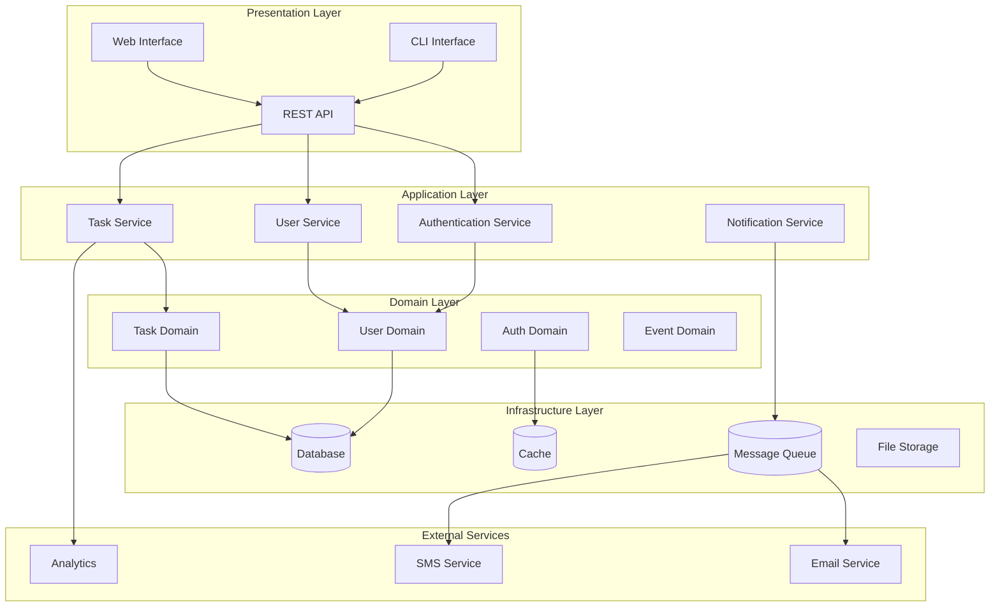

# System Architecture Design

## Overview

This document defines the comprehensive system architecture for the test project, following the SPARC methodology with claude-flow integration. The architecture prioritizes modularity, testability, and scalability while maintaining clear separation of concerns.

## Architectural Principles

### Core Principles
1. **Modular Design**: Each component < 500 lines, single responsibility
2. **Environment Safety**: No hardcoded secrets, configuration-driven
3. **Testability**: Dependency injection, mockable interfaces
4. **Scalability**: Horizontal scaling, stateless services
5. **Observability**: Comprehensive logging, monitoring, tracing

### Design Patterns
- **Hexagonal Architecture**: Clean separation between business logic and external adapters
- **Event-Driven Architecture**: Async communication via events
- **CQRS**: Command Query Responsibility Segregation for complex data operations
- **Repository Pattern**: Data access abstraction
- **Factory Pattern**: Object creation management

## High-Level System Architecture



## System Boundaries and Context

### Internal Systems
- **Core Application**: Business logic and domain models
- **Data Management**: Persistence and caching layers
- **Security**: Authentication and authorization
- **Integration**: Event processing and external service communication

### External Systems
- **User Interfaces**: Web, mobile, CLI clients
- **Third-party Services**: Email, SMS, analytics providers
- **Infrastructure**: Cloud services, databases, message queues

## Technology Stack

### Backend Services
```yaml
runtime: "Node.js 18+"
framework: "Express.js with TypeScript"
validation: "Joi/Zod for schema validation"
testing: "Jest with Supertest"
documentation: "OpenAPI/Swagger"
```

### Database Layer
```yaml
primary: "PostgreSQL 14+"
cache: "Redis 7+"
search: "Elasticsearch (if needed)"
migrations: "Knex.js migrations"
orm: "Prisma or TypeORM"
```

### Infrastructure
```yaml
containerization: "Docker with multi-stage builds"
orchestration: "Docker Compose (dev), Kubernetes (prod)"
monitoring: "Prometheus + Grafana"
logging: "Winston with structured logging"
tracing: "OpenTelemetry"
```

### Security
```yaml
authentication: "JWT with refresh tokens"
authorization: "Role-based access control (RBAC)"
encryption: "bcrypt for passwords, AES-256 for data"
transport: "TLS 1.3 minimum"
secrets: "Environment variables with validation"
```

## Non-Functional Requirements

### Performance
- **Response Time**: < 200ms for 95% of API calls
- **Throughput**: 1000+ requests/second per service
- **Concurrent Users**: 10,000+ active users
- **Database**: < 100ms query response time

### Scalability
- **Horizontal Scaling**: Stateless services, load balancing
- **Database Scaling**: Read replicas, connection pooling
- **Caching Strategy**: Multi-layer caching (Redis, CDN)
- **Auto-scaling**: CPU/memory-based scaling triggers

### Reliability
- **Availability**: 99.9% uptime target
- **Recovery**: < 5 minutes RTO, < 1 hour RPO
- **Fault Tolerance**: Circuit breakers, retry mechanisms
- **Data Consistency**: ACID transactions where needed

### Security
- **Authentication**: Multi-factor authentication support
- **Data Protection**: Encryption at rest and in transit
- **Audit Logging**: Comprehensive audit trails
- **Compliance**: GDPR compliance for user data

## Integration Patterns

### API Design
```yaml
style: "RESTful with GraphQL for complex queries"
versioning: "URL path versioning (/api/v1/)"
documentation: "OpenAPI 3.0 specification"
error_handling: "Consistent error response format"
rate_limiting: "Per-user and per-endpoint limits"
```

### Event-Driven Communication
```yaml
pattern: "Publish-Subscribe with event sourcing"
transport: "RabbitMQ or Apache Kafka"
serialization: "JSON with schema validation"
reliability: "At-least-once delivery guarantee"
dead_letter: "Dead letter queues for failed events"
```

### Data Integration
```yaml
synchronization: "CDC (Change Data Capture) where needed"
batch_processing: "Scheduled ETL jobs"
api_integration: "RESTful APIs with retry logic"
webhook_support: "Outbound webhooks for integrations"
```

## Development Architecture

### Project Structure
```
project/
├── src/
│   ├── domain/          # Domain models and business logic
│   ├── application/     # Application services and use cases
│   ├── infrastructure/  # External service adapters
│   ├── presentation/    # API controllers and routes
│   └── shared/         # Common utilities and types
├── tests/
│   ├── unit/           # Unit tests
│   ├── integration/    # Integration tests
│   └── e2e/           # End-to-end tests
├── docs/
│   ├── api/           # API documentation
│   └── architecture/  # Architecture documentation
└── config/            # Configuration files
```

### Code Organization Principles
1. **Domain-Driven Design**: Rich domain models with business logic
2. **Clean Architecture**: Dependency inversion, testable code
3. **Separation of Concerns**: Single responsibility per module
4. **Interface Segregation**: Small, focused interfaces
5. **Dependency Injection**: Constructor injection pattern

## Quality Assurance

### Testing Strategy
```yaml
unit_tests: "90%+ code coverage, fast feedback"
integration_tests: "Database and external service integration"
contract_tests: "API contract validation"
e2e_tests: "Critical user journey validation"
performance_tests: "Load and stress testing"
```

### Code Quality
```yaml
linting: "ESLint with strict TypeScript rules"
formatting: "Prettier for consistent code style"
type_checking: "Strict TypeScript configuration"
security_scanning: "Automated security vulnerability scanning"
dependency_scanning: "Regular dependency updates and audits"
```

## Monitoring and Observability

### Metrics Collection
```yaml
application_metrics: "Custom business metrics"
system_metrics: "CPU, memory, disk, network"
database_metrics: "Query performance, connection pools"
api_metrics: "Request rate, response time, error rate"
```

### Logging Strategy
```yaml
format: "Structured JSON logging"
levels: "ERROR, WARN, INFO, DEBUG"
correlation: "Request ID tracking across services"
retention: "90 days for application logs"
aggregation: "Centralized log aggregation"
```

### Health Checks
```yaml
liveness: "Basic service health endpoint"
readiness: "Dependency readiness checks"
startup: "Initialization completion checks"
deep_health: "Comprehensive system health"
```

## Deployment Considerations

### Environment Strategy
- **Development**: Local Docker Compose setup
- **Testing**: Kubernetes cluster with test data
- **Staging**: Production-like environment for final testing
- **Production**: Multi-zone Kubernetes deployment

### Configuration Management
- **Environment Variables**: Service configuration
- **ConfigMaps**: Application configuration
- **Secrets**: Sensitive configuration data
- **Feature Flags**: Runtime feature toggling

### Database Strategy
- **Migration Management**: Automated database migrations
- **Backup Strategy**: Daily automated backups with point-in-time recovery
- **Disaster Recovery**: Multi-region backup replication
- **Performance Monitoring**: Query performance tracking

This architecture provides a solid foundation for a scalable, maintainable, and secure system that can grow with business needs while maintaining high quality and performance standards.