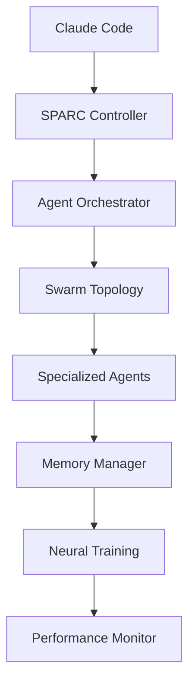

# Detailed System Specifications

## 1. System Architecture Overview

### 1.1 Core Components
```yaml
system:
  orchestrator: claude-flow
  methodology: SPARC
  coordination: swarm-based
  execution: parallel
  memory: persistent
  learning: neural-enhanced
```

### 1.2 Component Interactions


## 2. SPARC Methodology Specification

### 2.1 Phase Definitions
```yaml
sparc_phases:
  specification:
    description: "Requirements analysis and system specification"
    outputs: ["requirements.md", "specifications.md", "interfaces.md"]
    agents: ["researcher", "analyst", "specification"]
    
  pseudocode:
    description: "Algorithm design and logical flow"
    outputs: ["pseudocode.md", "algorithms.md", "data-flow.md"]
    agents: ["architect", "pseudocode", "algorithm-designer"]
    
  architecture:
    description: "System design and component architecture"
    outputs: ["architecture.md", "component-design.md", "api-design.md"]
    agents: ["system-architect", "api-designer", "component-architect"]
    
  refinement:
    description: "Test-driven development and implementation"
    outputs: ["tests/", "src/", "implementation.md"]
    agents: ["tdd-engineer", "coder", "tester", "reviewer"]
    
  completion:
    description: "Integration, validation, and deployment"
    outputs: ["integration-tests/", "deployment.md", "validation.md"]
    agents: ["integration-tester", "deployment-engineer", "validator"]
```

### 2.2 Workflow State Machine
```yaml
states:
  idle:
    description: "System ready for new tasks"
    transitions: ["specification_start"]
    
  specification_active:
    description: "Requirements analysis in progress"
    transitions: ["pseudocode_start", "specification_retry", "abort"]
    
  pseudocode_active:
    description: "Algorithm design in progress"
    transitions: ["architecture_start", "pseudocode_retry", "abort"]
    
  architecture_active:
    description: "System design in progress"
    transitions: ["refinement_start", "architecture_retry", "abort"]
    
  refinement_active:
    description: "TDD implementation in progress"
    transitions: ["completion_start", "refinement_retry", "abort"]
    
  completion_active:
    description: "Integration and validation in progress"
    transitions: ["complete", "completion_retry", "abort"]
    
  complete:
    description: "Workflow successfully completed"
    transitions: ["idle"]
    
  error:
    description: "Error state with recovery options"
    transitions: ["retry", "abort", "idle"]
```

## 3. Agent System Specifications

### 3.1 Agent Categories
```yaml
agent_categories:
  core_development:
    agents: ["coder", "reviewer", "tester", "planner", "researcher"]
    max_concurrent: 5
    coordination_type: "mesh"
    
  swarm_coordination:
    agents: ["hierarchical-coordinator", "mesh-coordinator", "adaptive-coordinator"]
    max_concurrent: 3
    coordination_type: "hierarchical"
    
  consensus_distributed:
    agents: ["byzantine-coordinator", "raft-manager", "gossip-coordinator"]
    max_concurrent: 3
    coordination_type: "distributed"
    
  performance_optimization:
    agents: ["perf-analyzer", "performance-benchmarker", "task-orchestrator"]
    max_concurrent: 4
    coordination_type: "specialized"
```

### 3.2 Agent Lifecycle
```yaml
lifecycle:
  spawn:
    - validate_agent_type
    - allocate_resources
    - initialize_memory
    - establish_coordination
    - register_with_swarm
    
  coordinate:
    - pre_task_hook
    - load_context
    - execute_task
    - post_task_hook
    - update_memory
    
  communicate:
    - message_routing
    - state_synchronization
    - knowledge_sharing
    - consensus_building
    
  terminate:
    - save_state
    - cleanup_resources
    - notify_swarm
    - archive_results
```

### 3.3 Communication Protocols
```yaml
communication:
  message_types:
    - coordination_request
    - status_update
    - knowledge_share
    - error_notification
    - completion_signal
    
  routing:
    topology_based: true
    priority_queue: true
    reliable_delivery: true
    encryption: false  # internal communication
    
  formats:
    coordination: "json"
    memory: "sqlite"
    logs: "structured_text"
```

## 4. Memory Management Specifications

### 4.1 Memory Architecture
```yaml
memory_system:
  storage:
    type: "sqlite"
    location: "./memory/claude-flow-data.json"
    backup: true
    compression: true
    
  namespaces:
    - default
    - sparc/spec
    - sparc/pseudo
    - sparc/arch
    - sparc/refine
    - sparc/complete
    - agents
    - coordination
    - performance
    
  ttl_policies:
    default: "24h"
    sparc: "7d"
    agents: "1h"
    coordination: "30m"
    performance: "1d"
```

### 4.2 Memory Operations
```yaml
operations:
  store:
    parameters: [action, key, value, namespace, ttl]
    validation: true
    indexing: true
    
  retrieve:
    parameters: [action, key, namespace]
    caching: true
    compression: auto
    
  list:
    parameters: [action, pattern, namespace]
    pagination: true
    filtering: true
    
  search:
    parameters: [action, pattern, limit]
    indexing: full_text
    ranking: relevance
    
  delete:
    parameters: [action, key, namespace]
    soft_delete: true
    archiving: true
```

### 4.3 Cross-Session Persistence
```yaml
persistence:
  session_management:
    auto_save: true
    session_id: "swarm-{timestamp}"
    context_restoration: true
    
  data_retention:
    active_sessions: "30d"
    archived_sessions: "90d"
    performance_metrics: "1y"
    
  backup_strategy:
    frequency: "1h"
    retention: "7d"
    compression: "gzip"
    verification: "checksum"
```

## 5. Parallel Execution Specifications

### 5.1 Concurrency Model
```yaml
concurrency:
  execution_model: "task_parallel"
  coordination_model: "shared_memory"
  synchronization: "event_driven"
  
  constraints:
    max_parallel_tasks: 10
    max_agents_per_task: 5
    task_timeout: "300s"
    coordination_timeout: "30s"
```

### 5.2 Task Distribution
```yaml
distribution:
  load_balancing:
    algorithm: "least_loaded"
    factors: ["agent_load", "task_complexity", "resource_availability"]
    
  task_scheduling:
    priority_levels: ["critical", "high", "medium", "low"]
    scheduling_algorithm: "priority_queue"
    preemption: false
    
  resource_allocation:
    cpu_cores: "auto"
    memory_limit: "2GB"
    storage_limit: "1GB"
```

### 5.3 Fault Tolerance
```yaml
fault_tolerance:
  self_healing:
    enabled: true
    retry_attempts: 3
    backoff_strategy: "exponential"
    
  failure_detection:
    heartbeat_interval: "30s"
    failure_threshold: 3
    recovery_time: "60s"
    
  recovery_strategies:
    - agent_restart
    - task_reassignment
    - topology_reconfiguration
    - graceful_degradation
```

## 6. Neural Training Specifications

### 6.1 Learning Models
```yaml
neural_models:
  coordination_patterns:
    type: "sequence_learning"
    input: "agent_interactions"
    output: "optimal_topology"
    
  performance_optimization:
    type: "reinforcement_learning"
    input: "execution_metrics"
    output: "optimization_suggestions"
    
  error_prediction:
    type: "classification"
    input: "code_patterns"
    output: "error_probability"
    
  code_generation:
    type: "transformer"
    input: "specifications"
    output: "code_suggestions"
```

### 6.2 Training Pipeline
```yaml
training:
  data_collection:
    sources: ["agent_logs", "performance_metrics", "code_patterns"]
    preprocessing: true
    feature_extraction: true
    
  model_training:
    frequency: "daily"
    batch_size: 32
    epochs: 50
    validation_split: 0.2
    
  model_evaluation:
    metrics: ["accuracy", "precision", "recall", "f1_score"]
    cross_validation: true
    benchmark_tests: true
    
  model_deployment:
    versioning: true
    a_b_testing: true
    rollback_capability: true
```

### 6.3 Pattern Recognition
```yaml
patterns:
  cognitive_patterns:
    - convergent_thinking
    - divergent_thinking
    - lateral_thinking
    - systems_thinking
    - critical_thinking
    - adaptive_thinking
    
  coordination_patterns:
    - hierarchical_coordination
    - mesh_coordination
    - ring_coordination
    - star_coordination
    
  development_patterns:
    - tdd_patterns
    - refactoring_patterns
    - design_patterns
    - architecture_patterns
```

## 7. Performance Monitoring

### 7.1 Metrics Collection
```yaml
metrics:
  execution_metrics:
    - task_completion_time
    - agent_utilization
    - coordination_overhead
    - memory_usage
    - cpu_usage
    
  quality_metrics:
    - code_coverage
    - test_pass_rate
    - bug_detection_rate
    - code_quality_score
    
  user_experience:
    - response_time
    - success_rate
    - error_frequency
    - user_satisfaction
```

### 7.2 Performance Targets
```yaml
targets:
  speed_improvement: "2.8x - 4.4x"
  token_reduction: "32.3%"
  solve_rate: "84.8%"
  response_time: "<1s"
  uptime: "99.9%"
  error_rate: "<0.1%"
```

### 7.3 Optimization Strategies
```yaml
optimization:
  automatic_scaling:
    enabled: true
    scale_up_threshold: "80%"
    scale_down_threshold: "20%"
    
  caching_strategy:
    levels: ["memory", "disk", "distributed"]
    invalidation: "ttl_based"
    compression: true
    
  resource_optimization:
    memory_pooling: true
    connection_pooling: true
    batch_processing: true
```

## 8. Integration Specifications

### 8.1 GitHub Integration
```yaml
github:
  authentication:
    method: "oauth_token"
    scopes: ["repo", "read:org", "workflow"]
    
  operations:
    - repository_analysis
    - pull_request_management
    - issue_tracking
    - workflow_automation
    - code_review
    - release_management
    
  webhooks:
    events: ["push", "pull_request", "issues"]
    processing: "asynchronous"
    retry_policy: "exponential_backoff"
```

### 8.2 Build System Integration
```yaml
build_integration:
  package_managers:
    - npm
    - yarn
    - pnpm
    
  testing_frameworks:
    - jest
    - mocha
    - vitest
    - cypress
    
  quality_tools:
    - eslint
    - prettier
    - typescript
    - husky
```

### 8.3 Deployment Integration
```yaml
deployment:
  platforms:
    - docker
    - kubernetes
    - aws
    - vercel
    - netlify
    
  strategies:
    - blue_green
    - canary
    - rolling_update
    - feature_flags
```

## 9. Security Specifications

### 9.1 Security Requirements
```yaml
security:
  authentication:
    required: true
    method: "token_based"
    token_expiry: "24h"
    
  authorization:
    rbac: true
    permissions: ["read", "write", "execute", "admin"]
    
  data_protection:
    encryption_at_rest: true
    encryption_in_transit: true
    key_rotation: "monthly"
    
  audit_logging:
    enabled: true
    retention: "1y"
    compliance: "gdpr"
```

### 9.2 Vulnerability Management
```yaml
vulnerability:
  scanning:
    frequency: "daily"
    tools: ["snyk", "dependabot", "codeql"]
    
  response:
    critical: "4h"
    high: "24h"
    medium: "7d"
    low: "30d"
```

## 10. Configuration Management

### 10.1 Configuration Structure
```yaml
configuration:
  environment:
    development:
      debug: true
      logging_level: "debug"
      performance_monitoring: false
      
    production:
      debug: false
      logging_level: "info"
      performance_monitoring: true
      
  features:
    auto_topology_selection: true
    parallel_execution: true
    neural_training: true
    bottleneck_analysis: true
    smart_auto_spawning: true
    self_healing_workflows: true
    cross_session_memory: true
    github_integration: true
```

### 10.2 Runtime Configuration
```yaml
runtime:
  max_agents: 10
  default_topology: "hierarchical"
  execution_strategy: "parallel"
  token_optimization: true
  cache_enabled: true
  telemetry_level: "detailed"
```